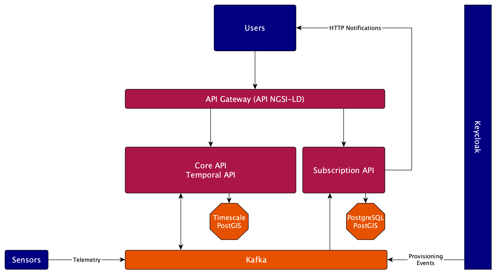

# General architecture
## Services
Stellio is composed of 2 business services:

-   One service (called `search-service` in the source) is in charge of handling the requests 
    for the Core and Temporal APIs. It is backed by a PostgreSQL database, extended with 
    the [TimescaleDB](https://www.timescale.com/) and [PostGIS](https://postgis.net/) extensions 
-   One service (called `subscription-service` in the source) is in charge of handling the requests 
    for the Subscription API. It is backed by a PostgreSQL database, extended with the
    [PostGIS](https://postgis.net/) extension

It is completed with:

-   An API Gateway component, based on [Spring Cloud Gateway](https://cloud.spring.io/spring-cloud-gateway/reference/html/), 
    that simply forwards the incoming requests to one of the downstream services, based on the request path
-   A [Kafka](https://kafka.apache.org/) streaming engine that decouples communication inside the broker 
    (and allows plugging other services seamlessly). It is described in more details in the
    next chapter on the [internal event model](#internal-event-model)



The services are based on the [Spring Boot](https://spring.io/projects/spring-boot) framework, developed in [Kotlin](https://kotlinlang.org), and built with [Gradle](https://gradle.org).

## Internal event model

As explained above, Stellio internally uses a Kafka message broker to decouple communication between the 2 main services.

This communication is based on an event model inspired by the NGSI-LD API and does its best to follow the same design principles.

Currently, the following events are flowing inside the platform:

- Operations done on entities through the NGSI-LD API (including batch operations)
    - Used by the subscription service to trigger notifications if there are some matching subscriptions
- Identity and access management events sent by Keycloak
    - Listened by Stellio services to provision users, groups and clients, as well as their global roles and groups memberships
- Telemetry events received from sensors (for high ingestion rates scenarios)

One core principle of the event model is that an event is atomic, i.e., it contains only one operation. So, for instance, if 2 attributes are added to an entity, 2 events will be propagated.

### Types and structure of events

Below is the list of supported events, accompanied by a sample payload (for ease of reading, the payloads presented
are JSON-LD compacted, but when sent by Stellio, they are JSON-LD expanded):

- Entity creation

```json
{
    "tenantName": "urn:ngsi-ld:tenant:stellio",
    "entityId": "urn:ngsi-ld:Vehicle:A4567",
    "entityTypes": ["https://vocab.egm.io/Vehicle"],
    "operationPayload": "{\"id\": \"urn:ngsi-ld:Vehicle:A4567\", \"type\": \"Vehicle\", \"brandName\": { \"type\": \"Property\", \"value\": \"Mercedes\"}}",
    "operationType": "ENTITY_CREATE"
}
```

- Entity deletion

```json
{
    "tenantName": "urn:ngsi-ld:tenant:stellio",
    "entityId": "urn:ngsi-ld:Vehicle:A4567",
    "entityTypes": ["https://vocab.egm.io/Vehicle"],
    "previousEntity": "(expanded payload of the entity before the delete operation)",
    "updateEntity": "(expanded payload of the entity after the delete operation: only id and deletedAt timestamp)",
    "operationType": "ENTITY_DELETE"
}
```

- Attribute append

```json
{
    "tenantName": "urn:ngsi-ld:tenant:stellio",
    "entityId": "urn:ngsi-ld:Vehicle:A4567",
    "entityTypes": ["https://vocab.egm.io/Vehicle"],
    "attributeName": "https://vocab.egm.io/speed",
    "datasetId": "urn:ngsi-ld:Dataset:GPS",
    "operationPayload": "{ \"value\": 76, \"unitCode\": \"KMH\", \"observedAt\": \"2021-10-26T22:35:52.98601Z\", \"datasetId\": \"urn:ngsi-ld:Dataset:GPS\" }",
    "updatedEntity": "(expanded payload of the entity after the append operation)",
    "operationType": "ATTRIBUTE_CREATE"
}
```

- Attribute update

```json
{
    "tenantName": "urn:ngsi-ld:tenant:stellio",
    "entityId": "urn:ngsi-ld:Vehicle:A4567",
    "entityTypes": ["https://vocab.egm.io/Vehicle"],
    "attributeName": "https://vocab.egm.io/speed",
    "datasetId": "urn:ngsi-ld:Dataset:GPS",
    "previousPayload": "{ \"value\":57, \"observedAt\": \"2021-10-26T23:34:52.98601Z\" }",
    "operationPayload": "{ \"value\":60, \"observedAt\": \"2021-10-26T23:35:52.98601Z\" }",
    "updatedEntity": "(expanded payload of the entity after the update operation)",
    "operationType": "ATTRIBUTE_UPDATE"
}
```

- Attribute deletion

```json
{
    "tenantName": "urn:ngsi-ld:tenant:stellio",
    "entityId": "urn:ngsi-ld:Vehicle:A4567",
    "entityTypes": ["https://vocab.egm.io/Vehicle"],
    "attributeName": "https://vocab.egm.io/speed",
    "datasetId": "urn:ngsi-ld:Dataset:GPS",
    "previousPayload": "{ \"value\":57, \"observedAt\": \"2021-10-26T23:34:52.98601Z\" }",
    "updatedEntity": "(expanded payload of the entity after the delete operation)",
    "operationType": "ATTRIBUTE_DELETE"
}
```

### Mapping from Core API operations to `notificationTrigger` in subscriptions

Starting from version 1.6.1 of the NGSI-LD specification, subscriptions support a new `notificationTrigger` member (see 5.2.12 for more details).
The notification trigger indicates what kind of changes shall trigger a notification.

The following table summarizes the events triggered by each Core API operation:

| Core API operation             | Notification trigger                                                        |
| ------------------------------ | --------------------------------------------------------------------------- |
| Create Entity                  | `entityCreated`<br>one `attributeCreated` event per attribute in the entity |
| Update Attributes              | `attributeCreated` (did non exist previously)<br>`attributeUpdated` (existed previously)<br>`attributeDeleted` (via NGSI-LD Null) |
| Append Attributes              | `attributeCreated` (did non exist previously)<br>`attributeUpdated` (existed previously)|
| Partial Attribute Update       | `attributeUpdated`<br>`attributeDeleted` (via NGSI-LD Null)                 |
| Delete Attribute               | `attributeDeleted`                                                          |
| Delete Entity                  | `entityDeleted`<br>one `attributeDeleted` event per attribute in the entity |
| Merge Entity                   | `attributeCreated` (did non exist previously)<br>`attributeUpdated` (existed previously)<br>`attributeDeleted` (via NGSI-LD Null) |
| Replace Entity                 | `attributeDeleted` (does not exist in new entity)<br>`attributeCreated` (did non exist previously)<br>`attributeUpdated` (exists in previous and new entity) |
| Replace Attribute              | `attributeUpdated`                                                          |
