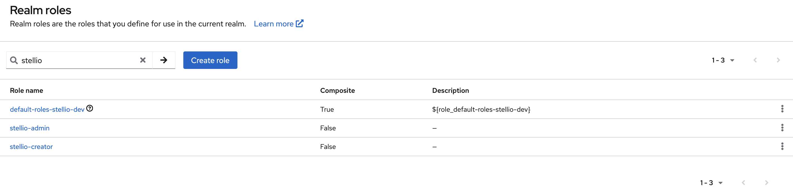

# Keycloak integration

Stellio can be used with the [Keycloak](https://www.keycloak.org) IAM solution.

This page presents a basic solution to show how to setup the integration between Stellio and Keycloak. **It is only meant for development purposes, please refer to Keycloak documentation to set up a production deployment**.

In the remainder of this page, it is considered that Stellio is running using the [docker-compose configuration](https://github.com/stellio-hub/stellio-context-broker/blob/develop/docker-compose.yml) provided on GitHub. Before starting this tutorial, ensure that the Stellio's Kafka broker is advertising its `PLAINTEXT_HOST` listener on an IP address that will be resolvable from the Keycloak container (running in its own docker network and not the same Docker network than Stellio), e.g.:

```yaml
    environment:
      KAFKA_ADVERTISED_LISTENERS: PLAINTEXT://stellio-kafka:9092,PLAINTEXT_HOST://{kafka_ip}:29092
      # Other environment variables
```

Where `kafka_ip` is the IP address where the Stellio's Kafka instance is reachable outside the Docker network (e.g., your laptop or VM IP)

Keycloak will be launched using the docker-compose configuration provided later in this document, in **development** mode.

## Connect Keycloak with Stellio

Configuration of Keycloak is not described here, as it is well documented on the Keycloak site.

In order to connect Stellio with Keycloak, the following steps have to be followed:

- Choose the correct Keycloak version
- Configure and run the [Keycloak Docker image provided by EGM](https://hub.docker.com/repository/docker/easyglobalmarket/keycloak)
- Create a realm in Keycloak
- Create the builtin roles known and used by Stellio
- Configure Keycloak to propagate user, group and client events to Stellio
- Activate and configure authentication in Stellio

### Choose the correct version of Keycloak

As there are sometimes modifications in the Kafka plugin that transmits user-related events to Stellio 
(mainly related to modifications of the Stellio internal event model), some versions of Stellio require 
a minimal version of Keycloak for the communication to happen correctly.

The following table summarizes these compatibility requirements:

| Stellio version         | Keycloak version                |
| ----------------------- | ------------------------------- |
| 2.25.0                  | 26.3.4                          |
| 2.22.0                  | 26.2.0                          |
| 2.19.0                  | 26.0.7                          |


### Use the Keycloak Docker image by EGM

The provided Docker image extends the official Keycloak Docker image to bundle it with three SPIs:

- An event listener that propagates provisioning events to the Kafka message broker used by Stellio
- An account notifier that sends an email to the realm admins whenever a new account is created
- A metrics listener that exposes an endpoint that can be consumed by Prometheus (https://github.com/aerogear/keycloak-metrics-spi)

To start with, you can use this sample Docker compose file (do not forget to create a `.env` file with the environment variables used in the docker compose file):

```yaml
services:
  keycloak:
    container_name: keycloak
    image: easyglobalmarket/keycloak:26.3.5
    restart: always
    environment:
      - KC_BOOTSTRAP_ADMIN_USERNAME=${KEYCLOAK_ADMIN}
      - KC_BOOTSTRAP_ADMIN_PASSWORD=${KEYCLOAK_ADMIN_PASSWORD}
      - KC_DB_URL_HOST=postgres
      - KC_DB_URL_DATABASE=${KEYCLOAK_DB_DATABASE}
      - KC_DB_USERNAME=${KEYCLOAK_DB_USERNAME}
      - KC_DB_PASSWORD=${KEYCLOAK_DB_PASSWORD}
      - KC_LOG_LEVEL=${LOG_LEVEL}
      - KC_HOSTNAME=${KEYCLOAK_HOSTNAME}
      # https://www.keycloak.org/server/configuration-provider#_configuration_option_format
      - KC_SPI_EVENTS_LISTENER_STELLIO_EVENT_LISTENER_KAFKA_BOOTSTRAP_SERVERS={realm_name}/{kafka_ip}:29092
      - KC_SPI_EVENTS_LISTENER_STELLIO_EVENT_LISTENER_KAFKA_KEY_SERIALIZER_CLASS=org.apache.kafka.common.serialization.StringSerializer
      - KC_SPI_EVENTS_LISTENER_STELLIO_EVENT_LISTENER_KAFKA_VALUE_SERIALIZER_CLASS=org.apache.kafka.common.serialization.StringSerializer
      - KC_SPI_EVENTS_LISTENER_STELLIO_EVENT_LISTENER_KAFKA_ACKS=all
      - KC_SPI_EVENTS_LISTENER_STELLIO_EVENT_LISTENER_KAFKA_DELIVERY_TIMEOUT_MS=3000
      - KC_SPI_EVENTS_LISTENER_STELLIO_EVENT_LISTENER_KAFKA_REQUEST_TIMEOUT_MS=2000
      - KC_SPI_EVENTS_LISTENER_STELLIO_EVENT_LISTENER_KAFKA_LINGER_MS=1
      - KC_SPI_EVENTS_LISTENER_STELLIO_EVENT_LISTENER_KAFKA_BATCH_SIZE=16384
      - KC_SPI_EVENTS_LISTENER_STELLIO_EVENT_LISTENER_KAFKA_MEMORY_BUFFER=33554432
      - KC_SPI_EVENTS_LISTENER_STELLIO_EVENT_LISTENER_TENANTS={realm_name}/{tenant_name}
    ports:
      # Using a different port than the ones used by Stellio to avoid conflicts when deployed on the same host
      - 9080:8080
      # Health checks
      - 9000:9000
    depends_on:
      - postgres
    command: "start-dev"
  postgres:
    container_name: postgres
    image: postgres:16-alpine
    restart: always
    volumes:
      - postgres_data:/var/lib/postgresql/data
    environment:
      POSTGRES_DB: ${KEYCLOAK_DB_DATABASE}
      POSTGRES_USER: ${KEYCLOAK_DB_USERNAME}
      POSTGRES_PASSWORD: ${KEYCLOAK_DB_PASSWORD}

volumes:
  postgres_data:
      driver: local
```

where:

- `realm_name` is the name of the realm to be created in the next section
- `tenant_name` is the name of the tenant in Stellio that the realm will be binded to (see the [multitenancy page](../user/multitenancy.md) for more details on this), set it to `urn:ngsi-ld:tenant:default` to use the default tenant.
- `kafka_ip` is the IP address where the Stellio's Kafka instance is reachable (e.g., your laptop or VM IP)

The `.env` file contains the following environment variables:

```
KEYCLOAK_ADMIN=keycloak
KEYCLOAK_ADMIN_PASSWORD=keycloakAdminPassword
KEYCLOAK_DB_DATABASE=keycloak
KEYCLOAK_DB_USERNAME=keycloak
KEYCLOAK_DB_PASSWORD=keycloakDbPassword
KEYCLOAK_HOSTNAME={keycloak_ip}
LOG_LEVEL=INFO
```

Where `keycloak_ip` is the IP address where Keycloak is reachable outside the Docker network (e.g., your laptop or VM IP)

Please note that for a production deployment, it is recommended to setup a certificate based authentication between Keycloak and Kafka and of course to only allow https connexions to Keycloak.

### Start Keycloak

```sh
docker compose up -d
```

### Create a realm

- Go to http://{keycloak_ip}:9080
- Authenticate to the administration console using the keycloak admin credentials defined in the docker compose configuration
- Follow instructions on how to [create a new realm in Keycloak](https://www.keycloak.org/docs/latest/server_admin/index.html#proc-creating-a-realm_server_administration_guide)

### Create the builtin roles

Stellio natively interprets two specific Realm roles that must first be created in Keycloak (see [procedure to create a realm role](https://www.keycloak.org/docs/latest/server_admin/index.html#proc-creating-realm-roles_server_administration_guide)):

- `stellio-creator`: it gives an user the right to create entities in the context broker
- `stellio-admin`: it gives an user the administrator rights in the context broker



### Configure Keycloak event listener

Go to the Realm settings > Events section and, in the Event listeners field, add `stellioEventListener`, `NotifyAccountEventLister` (to be notified of new accounts, the notification is sent to realm admins), and `metrics-listener` (if integrated with Prometheus)


### Configure authentication in Stellio

Finally, on Stellio side, activate authentication and configure the Keycloak URLs in search and subscription services in Docker compose config.

In the `.env` file, update the following environment variables:

```properties
STELLIO_AUTHENTICATION_ENABLED=true

APPLICATION_TENANTS_0_ISSUER=http://{keycloak_ip}:9080/realms/{realm_name}
```

Then restart Stellio:

```sh
docker compose up -d
```

### Validate the configuration

To validate the configuration is fully working, you can create a client in Keycloak and then create an entity in Stellio using this client:

- Create a client in Keycloak
  - Enable client authentication
  - Select the "Service accounts roles" authentication flow
  - Do not set any redirect URIs
- In the "Service account roles" tab, assign the `stellio-creator` realm role
- In the "Credentials" tab, copy the client secret (you will need it to get an access token below)

Then in a terminal:

- Get an access token for this client

```shell
export ACCESS_TOKEN=$(http --form POST http://{keycloak_ip}:9080/realms/{realm_name}/protocol/openid-connect/token client_id={client_id} client_secret={client_secret} grant_type=client_credentials | jq -r .access_token)
```

- Create a sample entity

```shell
echo -n '{ "id": "urn:ngsi-ld:Entity:01", "type": "Entity" }' | http POST http://localhost:8080/ngsi-ld/v1/entities Authorization:"Bearer $ACCESS_TOKEN"
```

If everything is correctly configured, you should get a `201 Created` response.

## Events raised by Keycloak

While creating and configuring users, groups and clients in Keycloak, the following events are raised by Keycloak and sent to the Kafka message broker operated by Stellio:

- Create an user

```json
{
  "operationType":"ENTITY_CREATE",
  "tenantName": "urn:ngsi-ld:tenant:default",
  "entityId":"urn:ngsi-ld:User:aaaaaaaa-bbbb-cccc-dddd-eeeeeeeeeeee",
  "entityTypes":["User"],
  "operationPayload":"{\"id\":\"urn:ngsi-ld:User:aaaaaaaa-bbbb-cccc-dddd-eeeeeeeeeeee\",\"type\":\"User\",\"username\":{\"type\":\"Property\",\"value\":\"user@mail.com\"},\"roles\":{\"type\":\"Property\",\"value\":\"stellio-creator\"}}",
  "contexts":["https://easy-global-market.github.io/ngsild-api-data-models/authorization/jsonld-contexts/authorization.jsonld","https://uri.etsi.org/ngsi-ld/v1/ngsi-ld-core-context-v1.7.jsonld"]
}
```

- Create a group

```json
{
  "operationType":"ENTITY_CREATE",
  "tenantName": "urn:ngsi-ld:tenant:default",
  "entityId":"urn:ngsi-ld:Group:zzzzzzzz-yyyy-xxxx-wwww-vvvvvvvvvvvv",
  "entityTypes":["Group"],
  "operationPayload":"{\"id\":\"urn:ngsi-ld:Group:zzzzzzzz-yyyy-xxxx-wwww-vvvvvvvvvvvv\",\"type\":\"Group\",\"name\":{\"type\":\"Property\",\"value\":\"Group name\"}}",
  "contexts":["https://easy-global-market.github.io/ngsild-api-data-models/authorization/jsonld-contexts/authorization.jsonld","https://uri.etsi.org/ngsi-ld/v1/ngsi-ld-core-context-v1.7.jsonld"]
}
```

- Create a client

```json
{
  "operationType":"ENTITY_CREATE",
  "tenantName":"urn:ngsi-ld:tenant:default",
  "entityId":"urn:ngsi-ld:Client:ffffffff-gggg-hhhh-iiii-jjjjjjjjjjjj",
  "entityTypes":["Client"],
  "operationPayload":"{\"id\":\"urn:ngsi-ld:Client:ffffffff-gggg-hhhh-iiii-jjjjjjjjjjjj\",\"type\":\"Client\",\"clientId\":{\"type\":\"Property\",\"value\":\"test\"},\"internalClientId\":{\"type\":\"Property\",\"value\":\"gggggggg-hhhh-iiii-kkkkkkkkkk\"}}",
  "contexts":["https://easy-global-market.github.io/ngsild-api-data-models/authorization/jsonld-contexts/authorization.jsonld","https://uri.etsi.org/ngsi-ld/v1/ngsi-ld-core-context-v1.7.jsonld"]
}
```

- Update realm roles of an user / group / client

An array of realm roles is sent, it is empty if the subject has no longer a realm role.

```json
{
  "operationType":"ATTRIBUTE_CREATE",
  "tenantName": "urn:ngsi-ld:tenant:default",
  "entityId":"urn:ngsi-ld:Client:ffffffff-gggg-hhhh-iiii-jjjjjjjjjjjj",
  "entityTypes":["Client"],
  "attributeName":"roles",
  "operationPayload":"{\"type\":\"Property\",\"value\":[\"stellio-creator\"]}",
  "updatedEntity":"",
  "contexts":["https://easy-global-market.github.io/ngsild-api-data-models/authorization/jsonld-contexts/authorization.jsonld","https://uri.etsi.org/ngsi-ld/v1/ngsi-ld-core-context-v1.7.jsonld"]
}
```

- Add an user to a group

```json
{
  "operationType":"ATTRIBUTE_CREATE",
  "tenantName": "urn:ngsi-ld:tenant:default",
  "entityId":"urn:ngsi-ld:User:aaaaaaaa-bbbb-cccc-dddd-eeeeeeeeeeee",
  "entityTypes":["User"],
  "attributeName":"isMemberOf",
  "datasetId":"urn:ngsi-ld:Dataset:isMemberOf:zzzzzzzz-yyyy-xxxx-wwww-vvvvvvvvvvvv",
  "operationPayload":"{\"type\":\"Relationship\",\"object\":\"urn:ngsi-ld:Group:zzzzzzzz-yyyy-xxxx-wwww-vvvvvvvvvvvv\",\"datasetId\":\"urn:ngsi-ld:Dataset:isMemberOf:zzzzzzzz-yyyy-xxxx-wwww-vvvvvvvvvvvv\"}",
  "updatedEntity":"",
  "contexts":["https://easy-global-market.github.io/ngsild-api-data-models/authorization/jsonld-contexts/authorization.jsonld","https://uri.etsi.org/ngsi-ld/v1/ngsi-ld-core-context-v1.7.jsonld"]
}
```

- Remove an user from a group

```json
{
  "operationType":"ATTRIBUTE_DELETE",
  "tenantName": "urn:ngsi-ld:tenant:default",
  "entityId":"urn:ngsi-ld:User:aaaaaaaa-bbbb-cccc-dddd-eeeeeeeeeeee",
  "entityTypes":["User"],
  "attributeName":"isMemberOf",
  "datasetId":"urn:ngsi-ld:Dataset:isMemberOf:zzzzzzzz-yyyy-xxxx-wwww-vvvvvvvvvvvv",
  "previousPayload": "",
  "updatedEntity":"",
  "contexts":["https://easy-global-market.github.io/ngsild-api-data-models/authorization/jsonld-contexts/authorization.jsonld","https://uri.etsi.org/ngsi-ld/v1/ngsi-ld-core-context-v1.7.jsonld"]
}
```

- Update the name of a group

```json
{
  "operationType":"ATTRIBUTE_UPDATE",
  "tenantName": "urn:ngsi-ld:tenant:default",
  "entityId":"urn:ngsi-ld:Group:zzzzzzzz-yyyy-xxxx-wwww-vvvvvvvvvvvv",
  "entityTypes":["Group"],
  "attributeName":"name",
  "operationPayload":"{\"type\":\"Property\",\"value\":\"New group name\"}",
  "previousPayload": "",
  "updatedEntity":"",
  "contexts":["https://easy-global-market.github.io/ngsild-api-data-models/authorization/jsonld-contexts/authorization.jsonld","https://uri.etsi.org/ngsi-ld/v1/ngsi-ld-core-context-v1.7.jsonld"]
}
```

- Delete a user / group / client

```json
{
  "operationType":"ENTITY_DELETE",
  "tenantName": "urn:ngsi-ld:tenant:default",
  "entityId":"urn:ngsi-ld:Group:zzzzzzzz-yyyy-xxxx-wwww-vvvvvvvvvvvv",
  "entityTypes":["Group"],
  "previousEntity": "",
  "contexts":["https://easy-global-market.github.io/ngsild-api-data-models/authorization/jsonld-contexts/authorization.jsonld","https://uri.etsi.org/ngsi-ld/v1/ngsi-ld-core-context-v1.7.jsonld"]
}
```