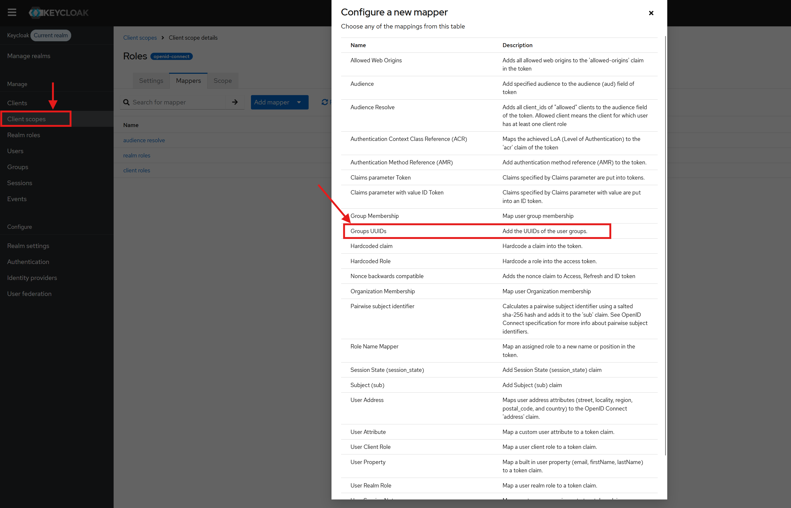
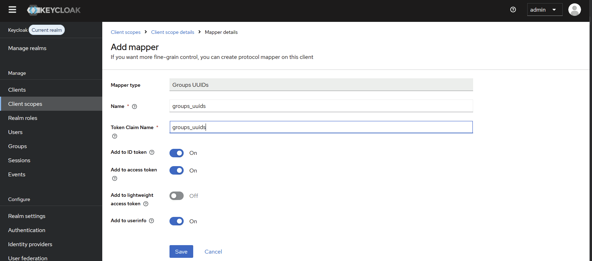
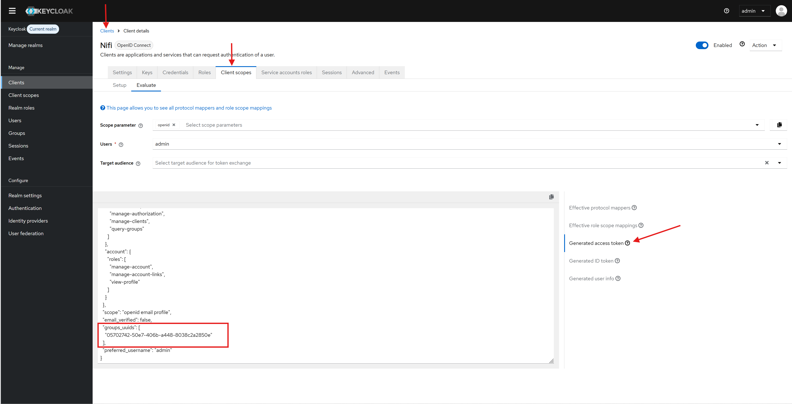

# Upgrading to 2.31.0

This note describes the necessary steps to upgrade to Stellio 2.31.0

## API gateway configuration 

The services URL are now fully configurable inside the api-gateway. 
As part of this change the `APPLICATION_SEARCH_SERVICE_URL` and `APPLICATION_SUBSCRIPTION_SERVICE_URL`
now contain the entire URL not only the hostname.

For example 
````
APPLICATION_SEARCH_SERVICE_URL=my-hostname
APPLICATION_SUBSCRIPTION_SERVICE_URL=my-hostname
````
will now become 
````
APPLICATION_SEARCH_SERVICE_URL=http://my-hostname:8083
APPLICATION_SUBSCRIPTION_SERVICE_URL=http://my-hostname:8084
````
If you don't use one of these variables, the change will not impact you.

## Authorization based on JWT token

The new authorization system work using only the OIDC token. Meaning you can use Stellio authorization features with any OpenId-Connect provider.
You can configure what JWT claims are considered with the `application.authentication.claims-paths` environment variable.
```
application.authentication.claims-paths = realm_access.roles,groups_uuids
```
Stellio checks all the configured claims in the user token (+ the user sub).
And use all permissions assigned to one of the user claims to evaluate the user rights.

## Migrating the current authorization setup
Out of the box, this will let you assign permission to Keycloak roles instead of groups.
It also means that the desynchronization of Stellio user information will only impact subject endpoints and never touch the NGSI-LD endpoints.

### Migrate groups permission
> **Warning:** You should follow this migration if you have permissions targeting groups.

Existing permission targeting groups id need to access the user groups ids in the token.
For this we have developed a new token mapper which is present in the new keycloak image (easyglobalmarket/keycloak:26.5.2).

Once the keycloak image is upgraded, you can configure the token mapper to add the groups uuids in the token.

#### Select the Groups UUID Mapper in Clients scopes > my-client-scope > Mappers > Add Mapper > by configuration 
(You can use an existing client scope or create your own, make sure it is used when generating the token)


#### Configure the mapper to add the ids behind the `groups_uuids` claim.


#### Verify that the groups uuids are present in the token. (in Clients > your-client > Clients scopes > evaluate > Generated access token)


When all the realms used by stellio have the `groups_uuids` claim configured. You are ready to upgrade to stellio:2.31.0 